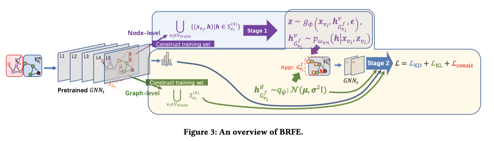

This is the repo for KDD2023 paper: [**Narrow the Input Mismatch in Deep Graph Neural Network Distillation**](https://kdd.org/kdd2023/)

The overview of BRFE (Bayesian Receptive Field Expander): 




# Step 1. Prepare teahcer models

```bash
cd ./teacher
python GCNII.py --dataset $DATASET --layer $LAYER --hidden_channels $HIDDEN --theta $THETA --dropout $DROPOUT --save_teacher
```

# Step 2. First stage training: node-level estimator

```bash
cd ../student
python student-GCN.py --hidden_channel $HIDDEN --dataset $DATASET --teacher_name $TEACHER
```


# Step 3. Second stage training: node-level estimator & student model

```bash
CUBLAS_WORKSPACE_CONFIG=:4096:8 python BRFE.py --dataset $DATASET --layer $LAYER  --nx_num $NUM [--n_input] --n_cvae $CVAE [--g_input] --near_hop $HOP [--g_opti] [--g_init] -dl $DIM_LIST -hl $HIDDEN_DIM_LIST --plus $FUSE_TYPE --teacher_name $TEACHER --alpha $ALPHA
```
